# 📚 BookStore Manager CLI

> **📌 Projeto em fase de conclusão**
>
> Este projeto foi desenvolvido como parte do Projeto Final Avaliativo do Módulo 01 do curso de Desenvolvimento Back-end com Node.js do SENAI, pelo Programa SCTec.
>
> As funcionalidades obrigatórias foram implementadas e a equipe está realizando a revisão final do código, da documentação e da apresentação do sistema.
>
> O sistema foi desenvolvido em squad de 3 integrantes, seguindo arquitetura em camadas, boas práticas de programação e persistência de dados utilizando PostgreSQL.
>

---

# 📝 Sobre o Projeto

O **BookStore Manager CLI** é uma aplicação back-end desenvolvida em **Node.js** e **TypeScript**, executada via terminal (CLI), que tem como objetivo gerenciar uma pequena livraria.

O sistema permite realizar o gerenciamento completo de:

- Autores
- Livros
- Clientes
- Empréstimos

Todos os dados são persistidos em um banco de dados **PostgreSQL**, utilizando SQL nativo através da biblioteca **pg**.

Este projeto está sendo desenvolvido como parte avaliativa do curso de **Desenvolvimento Back-end com Node.js** (Módulo 01) do **SENAI (Programa SCTec)**.

---

# 🎯 Objetivo

Aplicar, na prática, os principais conceitos estudados durante o módulo, tais como:

- Node.js
- TypeScript
- Programação Orientada a Objetos
- Arquitetura em Camadas
- Banco de Dados Relacional
- SQL
- PostgreSQL
- Programação Assíncrona
- Interfaces
- Classes
- Tratamento de Erros
- Clean Code
- SOLID
- Git
- GitHub
- GitFlow

---

# 🚧 Status do Projeto

As funcionalidades obrigatórias do sistema foram implementadas. Atualmente, a equipe está realizando a revisão final do código, concluindo a documentação e preparando o vídeo de apresentação.

### Progresso do Desenvolvimento

#### Infraestrutura

- [x] Planejamento inicial
- [x] Definição da arquitetura
- [x] Configuração do projeto Node.js + TypeScript
- [x] Configuração do PostgreSQL
- [x] Modelagem do banco de dados
- [x] Implementação da arquitetura em camadas

#### Funcionalidades

- [x] CRUD de Autores
- [x] CRUD de Livros
- [x] CRUD de Clientes
- [x] Controle de Empréstimos
- [x] Relatórios

#### Entrega

- [x] Documentação completa
- [ ] Vídeo de apresentação

---

# 🛠 Tecnologias Utilizadas

- Node.js (v24.14.1)
- TypeScript (v5.9.3)
- PostgreSQL (v18.4)
- SQL
- Biblioteca pg (v8.22.0)
- Git
- GitHub
- GitHub Pull Requests
- Jira (gerenciamento do projeto - metodologia kanban)

---

# 📋 Pré-requisitos

Antes de executar o projeto, certifique-se de possuir instalado em sua máquina:

- Node.js (20 ou superior)
- npm
- PostgreSQL
- Git
- Visual Studio Code (ou outra IDE compatível)

> O servidor PostgreSQL deve estar em execução, e o usuário informado nas variáveis de ambiente deve possuir permissão para criar bancos de dados.

---

# 🚀 Instalação

## 1. Clone o repositório

```bash
git clone https://github.com/rodrigomgrassioto/BookStore-Manager-CLI-SCTEC.git
```

Acesse a pasta do projeto:

```bash
cd BookStore-Manager-CLI-SCTEC
```

---

## 2. Instale as dependências

```bash
npm install
```

> O comando acima instalará automaticamente todas as dependências definidas no arquivo `package.json`, incluindo a biblioteca `pg`.

---

## 3. Configure as variáveis de ambiente

Crie um arquivo na raiz do projeto:

```text
.env
```

Copie para ele todo o conteúdo do arquivo:

```text
.env.example
```

Em seguida, configure as informações de acesso ao seu PostgreSQL.

> Não é necessário criar previamente o banco informado em `PG_DATABASE`. O script de schemas fará essa criação automaticamente caso ele ainda não exista.

---

## 4. Crie a estrutura do banco de dados

Execute:

```bash
npm run db:schemas
```

Esse comando:

- conecta-se ao banco padrão `postgres`;
- cria automaticamente o banco definido em `PG_DATABASE`, caso necessário;
- cria a tabela de controle `migrations_history`;
- executa, em ordem, os arquivos SQL presentes em:

```text
src/database/schemas/
```

Os schemas já registrados em `migrations_history` não são executados novamente.

---

## 5. Popule o banco de dados (Opcional)

Caso deseje inserir dados para testes:

```bash
npm run db:seed
```

Esse comando executará os arquivos SQL presentes em:

```text
src/database/seeds/
```

---

## 6. Execute a aplicação

> Para melhor visualização, execute o sistema com o terminal maximizado.

### Ambiente de desenvolvimento:

Para executar diretamente o código TypeScript:

```bash
npm run dev
```

### Aplicação compilada

Primeiro, compile o projeto:

```bash
npm run build
```

Depois, execute a versão compilada:

```bash
npm run start
```

---

### ⚠️ Possível erro de permissão ao usar o Windows PowerShell

Ao executar o projeto com:

```powershell
npm run dev
```

o PowerShell pode informar que o arquivo `npm.ps1` não pode ser carregado porque a execução de scripts está desabilitada:

```text
PSSecurityException
FullyQualifiedErrorId: UnauthorizedAccess
```

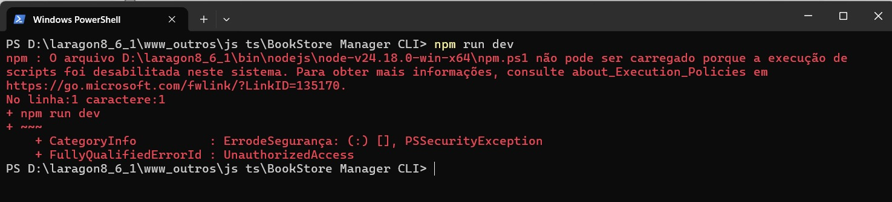

Nesse caso, escolha **uma** das opções abaixo.

#### Opção 1 — Liberação temporária (recomendada)

Libera a execução de scripts somente durante a sessão atual. Ao fechar o PowerShell, a configuração anterior será restaurada automaticamente.

Execute:

```powershell
Set-ExecutionPolicy Bypass -Scope Process -Force
```

Em seguida, tente iniciar novamente a aplicação:

```powershell
npm run dev
```

#### Opção 2 — Liberação permanente para o usuário atual

Altera a política de execução para o usuário conectado. Essa configuração continuará ativa mesmo depois de fechar o PowerShell.

Execute:

```powershell
Set-ExecutionPolicy RemoteSigned -Scope CurrentUser -Force
```

Em seguida, tente iniciar novamente a aplicação:

```powershell
npm run dev
```

---

# 📂 Estrutura do Projeto

A árvore estrutural do projeto segue uma arquitetura em camadas (**Layered Architecture**), separando responsabilidades para facilitar a manutenção, escalabilidade e organização do código.

```text
└── BookStore-Manager-CLI---SCTEC/                 # Pasta raiz do projeto
    │
    ├── .github/                                   # Configurações do repositório no GitHub
    │   └── CODEOWNERS                             # Define responsáveis pelo código
    │
    ├── src/                                       # Código-fonte principal da aplicação
    │   │
    │   ├── controllers/                           # Intermedia os menus e os serviços
    │   │   ├── AutorController.ts                 # Controla as operações de autores
    │   │   ├── ClienteController.ts               # Controla as operações de clientes
    │   │   ├── EmprestimoController.ts            # Controla empréstimos e devoluções
    │   │   ├── LivroController.ts                 # Controla as operações de livros
    │   │   └── RelatorioController.ts             # Controla a exibição dos relatórios
    │   │
    │   ├── database/                              # Configuração e inicialização do PostgreSQL
    │   │   │
    │   │   ├── schemas/                           # Scripts de criação e alteração das tabelas
    │   │   ├── seeds/                             # Scripts de inserção dos dados iniciais
    │   │   │
    │   │   ├── connection.ts                     # Configura o pool de conexão com o PostgreSQL
    │   │   ├── DatabaseSeeder.ts                 # Executa automaticamente os seeds
    │   │   └── RunSchemas.ts                     # Cria o banco e executa os schemas
    │   │
    │   ├── estilos/                               # Padronização visual da interface CLI
    │   │   ├── estilo.ts                         # Textos, divisores e mensagens do terminal
    │   │   └── estiloCores.ts                    # Códigos de cores utilizados no terminal
    │   │
    │   ├── img/                                   # Imagens dos fluxos exibidas no README
    │   │
    │   ├── menus/                                 # Menus de navegação da aplicação CLI
    │   │   ├── AutorMenu.ts                      # Submenu de autores
    │   │   ├── ClienteMenu.ts                    # Submenu de clientes
    │   │   ├── EmprestimoMenu.ts                 # Submenu de empréstimos
    │   │   ├── InicioMenu.ts                     # Menu principal da aplicação
    │   │   ├── LivroMenu.ts                      # Submenu de livros
    │   │   └── RelatorioMenu.ts                  # Submenu de relatórios
    │   │
    │   ├── models/                                # Interfaces e contratos de tipagem
    │   │   ├── AutorModel.ts                     # Modelos relacionados aos autores
    │   │   ├── ClienteModel.ts                   # Modelos relacionados aos clientes
    │   │   ├── EmprestimoModel.ts                # Modelos relacionados aos empréstimos
    │   │   ├── LivroModel.ts                     # Modelos relacionados aos livros
    │   │   └── RelatorioModel.ts                 # Modelos de retorno dos relatórios
    │   │
    │   ├── repositories/                          # Acesso e manipulação dos dados no PostgreSQL
    │   │   ├── AutorRepository.ts                # Consultas SQL de autores
    │   │   ├── ClienteRepository.ts              # Consultas SQL de clientes
    │   │   ├── EmprestimoRepository.ts           # Consultas SQL de empréstimos
    │   │   ├── LivroRepository.ts                # Consultas SQL de livros
    │   │   └── RelatoriosRepository.ts           # Consultas SQL dos relatórios
    │   │
    │   ├── services/                              # Regras de negócio e validações
    │   │   ├── AutorService.ts                   # Regras de negócio dos autores
    │   │   ├── ClienteService.ts                 # Regras de negócio dos clientes
    │   │   ├── EmprestimoService.ts              # Regras de empréstimos e devoluções
    │   │   ├── LivroService.ts                   # Regras de negócio dos livros
    │   │   └── RelatorioService.ts               # Processamento dos relatórios
    │   │
    │   ├── utils/                                 # Funções auxiliares reutilizáveis
    │   │   ├── formatadoresTexto.ts              # Formata os dados para exibição
    │   │   ├── gerarTabela.ts                    # Gera tabelas estilizadas no terminal
    │   │   ├── leitorFormatadorDeEntradas.ts     # Captura e converte entradas do terminal
    │   │   ├── tratamentosErrosBD.ts             # Padroniza erros do PostgreSQL
    │   │   └── validadores.ts                    # Valida dados das entidades
    │   │
    │   ├── configuracoes_empresa.json             # Regras configuráveis da biblioteca
    │   └── index.ts                               # Ponto de entrada da aplicação
    │
    ├── .env.example                               # Modelo das variáveis de ambiente
    ├── .gitignore                                 # Arquivos e diretórios ignorados pelo Git
    ├── package.json                               # Dependências e scripts do projeto
    ├── package-lock.json                          # Versões exatas das dependências
    ├── tsconfig.json                              # Configuração do compilador TypeScript
    └── README.md                                  # Documentação principal do projeto
```

## 🔄 Fluxo de execução da aplicação

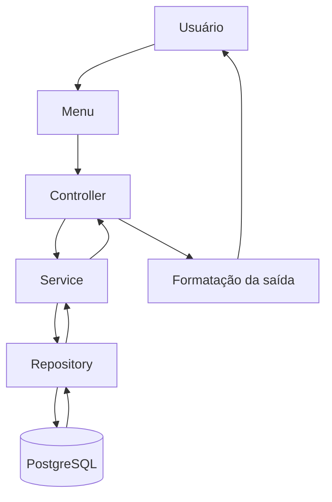

### Exemplo simplificado

Ao cadastrar um autor, o fluxo percorre as seguintes etapas:

```text
AutorMenu
    → AutorController
        → AutorService
            → AutorRepository
                → PostgreSQL
```

Após a operação, o resultado percorre o caminho inverso até ser apresentado ao usuário no terminal.

---

# 📚 Funcionalidades do Sistema

## Autores

- Cadastro
- Listagem
- Consulta
- Atualização
- Remoção

## Livros

- Cadastro
- Listagem
- Consulta
- Atualização
- Remoção

## Clientes

- Cadastro
- Listagem
- Consulta
- Atualização
- Remoção

## Empréstimos

- Registrar empréstimo
- Registrar devolução
- Consultar empréstimos

## Relatórios

- Livros disponíveis
- Livros emprestados
- Livros por autor
- Quantidade de empréstimos por livro
- Clientes com empréstimos ativos

---

### Regras de empréstimo

A biblioteca foi configurada com as seguintes regras de negócio:

- Cada empréstimo pode incluir, no máximo, **3 livros**.
- Cada cliente pode manter, no máximo, **5 livros emprestados simultaneamente**.
- O prazo padrão para devolução é de **14 dias**.

Essas regras estão definidas no arquivo:

```text
src/configuracoes_empresa.json
```

Os limites de livros por empréstimo e por cliente podem ser desativados atribuindo o valor `null` às respectivas configurações:

```json
{
  "max_livros_por_emprestimo": null,
  "max_livros_por_cliente": null
}
```

Quando configuradas como `null`, a aplicação ignora essas limitações e permite empréstimos sem um limite específico de livros por operação ou por cliente.

---

# 🗃 Banco de Dados

O **BookStore Manager CLI** utiliza **PostgreSQL** como Sistema Gerenciador de Banco de Dados (SGBD), com persistência realizada por meio de **SQL nativo**, utilizando a biblioteca **pg**.

A estrutura do banco foi organizada utilizando um fluxo inspirado no conceito de **migrations**, no qual cada alteração da estrutura é registrada em um arquivo SQL individual e executada automaticamente pelo projeto.

## Estrutura

```text
src/database/
│
├── schemas/             # Scripts SQL responsáveis pela criação e evolução do banco
├── seeds/               # Scripts SQL para inserção de dados de teste
├── connection.ts        # Configuração da conexão com o PostgreSQL
├── RunSchemas.ts        # Executor automático dos arquivos de schema
└── DatabaseSeeder.ts    # Executor automático dos arquivos de seed
```

## Schemas

Os arquivos presentes em `src/database/schemas/` são executados em ordem cronológica pelo comando:

```bash
npm run db:schemas
```

Durante a execução, o sistema:

- verifica se o banco de dados informado no arquivo `.env` existe;
- cria automaticamente o banco de dados, caso necessário;
- cria a tabela `migrations_history`, responsável pelo controle dos schemas já executados;
- executa apenas os scripts SQL que ainda não foram aplicados.

Cada arquivo representa uma alteração específica da estrutura do banco, como criação de tabelas, inclusão de constraints ou outras modificações.

## Seeds

Os arquivos presentes em `src/database/seeds/` são responsáveis por popular o banco de dados com registros para testes.

A execução é realizada através do comando:

```bash
npm run db:seed
```

Essa etapa é opcional e facilita a validação das funcionalidades durante o desenvolvimento da aplicação.

## Entidades do Sistema

O banco de dados é composto pelas seguintes entidades principais:

- Autores
- Livros
- Clientes
- Empréstimos

As relações entre essas entidades são garantidas por **Primary Keys**, **Foreign Keys**, **Constraints** e demais mecanismos de integridade referencial disponibilizados pelo PostgreSQL.

---

# 🌿 Versionamento

O projeto utiliza um fluxo de versionamento inspirado no **GitFlow**, adaptado às necessidades da equipe e aos requisitos acadêmicos do projeto.

## Branches principais

```text
main
develop
```

- **main**: contém apenas versões estáveis e prontas para entrega.
- **develop**: branch de integração, onde são reunidas e testadas as funcionalidades antes da incorporação à `main`.

## Branches de desenvolvimento

Cada funcionalidade é desenvolvida em uma **branch temporária**, criada a partir da `develop`, seguindo o padrão de nomenclatura definido pela equipe.

Exemplo:

```text
feat/kan-7-vit-clientes
refactor/kan-9-bcf-autor-melhorias
fix/kan-10-rmg-livro-repository
```

Onde:

- **feat**, **fix** ou **refactor** identificam o tipo da alteração;
- **kan-XX** corresponde ao cartão da tarefa no Kanban;
- **iniciais do integrante** identificam o responsável pela implementação;
- o último trecho descreve resumidamente a funcionalidade desenvolvida.

## Pull Requests

Todas as alterações são integradas à branch `develop` por meio de **Pull Requests (PRs)**.

Como prática adotada pela equipe:

- nenhum integrante aprova o próprio Pull Request;
- toda alteração passa por revisão de pelo menos outro integrante da squad antes da integração;
- somente após aprovação o código é incorporado à branch `develop`.

## Histórico das branches

Conforme requisito do projeto, **as branches temporárias não são removidas após o merge**, permanecendo disponíveis para consulta do histórico de desenvolvimento e avaliação da evolução do projeto.

---

### Fluxo resumido

```text
Branch de desenvolvimento
    → Implementação e testes
        → Pull Request
            → Revisão da equipe
                → Develop
                    → Testes
                        → Revisão final
                            → Main
```

---

# 📌 Kanban

O planejamento das etapas de desenvolvimento e acompanhamento das atividades foi gerenciado de forma visual por meio de um quadro Kanban, utilizando a ferramenta Jira.

Link do quadro: 
> https://rodrigomgrassioto.atlassian.net/jira/software/projects/KAN/boards/1

---

# 👥 Integrantes

- Bruna Caroline Fraga
- Rodrigo Medeiros Grassioto
- Vítor Olegário Becker de Aquino

---

# 🧪 Exemplo de Utilização

## Funcionalidades — Autor

### Cadastro e listagem

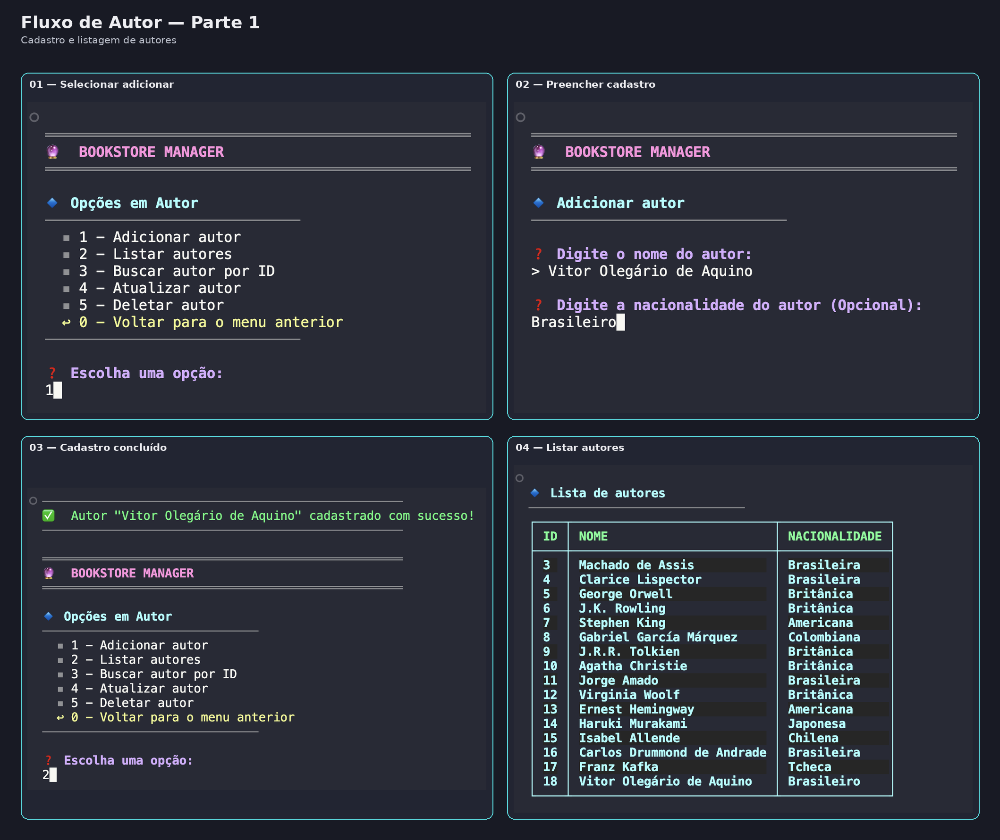

### Atualização, busca e exclusão

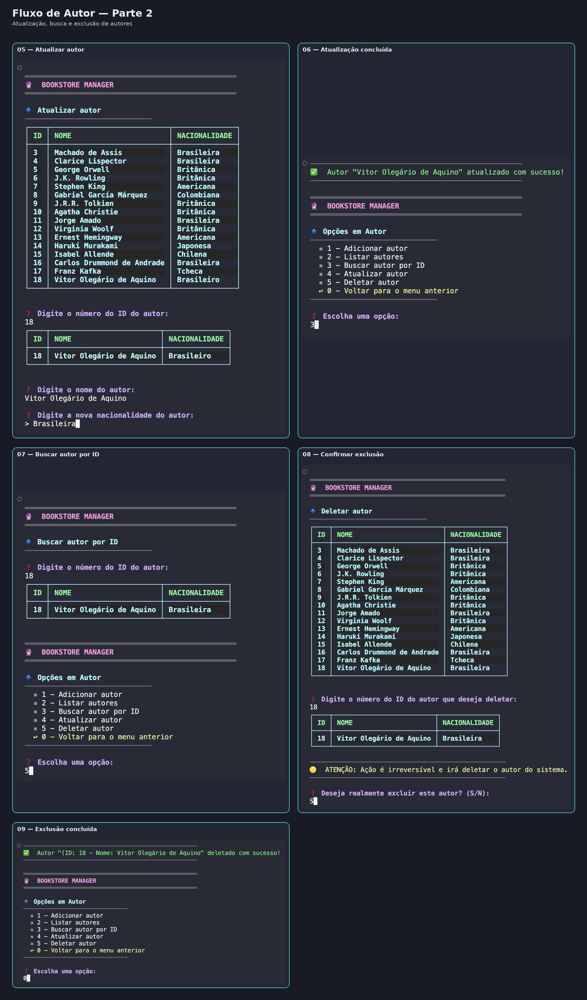


## Funcionalidades — Livro

### Cadastro, listagem e busca

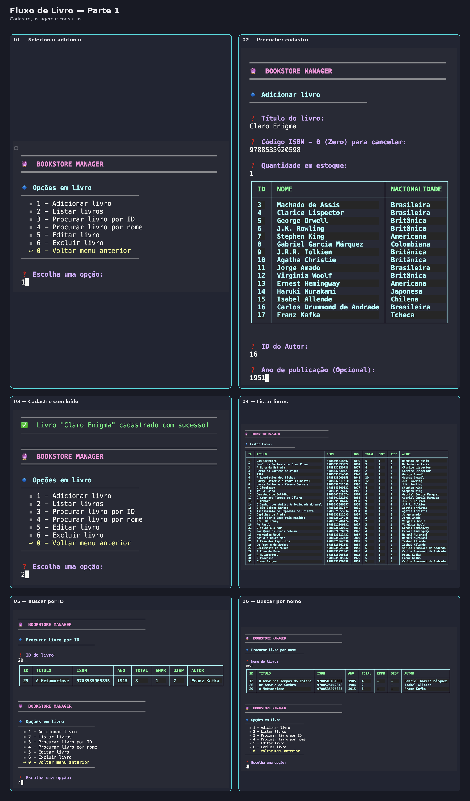

### Atualização e exclusão

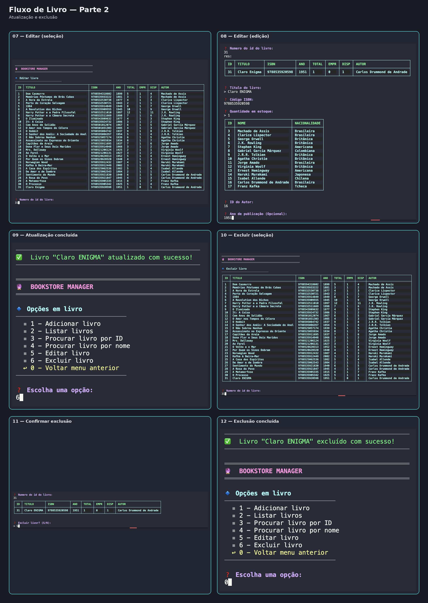


## Funcionalidades — Cliente

### Cadastro e listagem

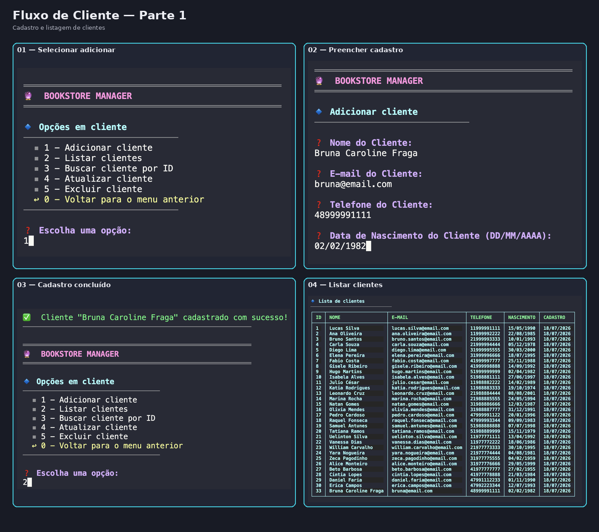

### Busca e exclusão

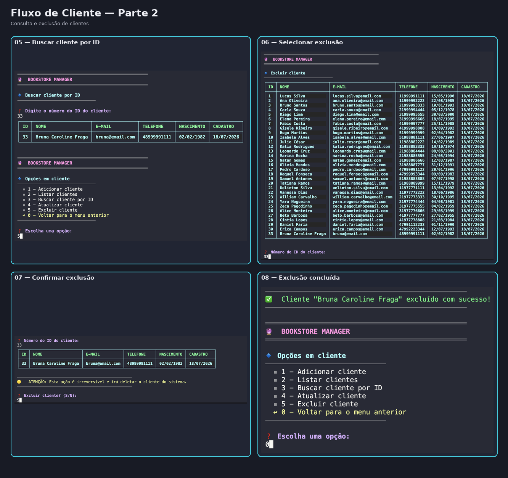


## Funcionalidades — Empréstimo

### Cadastro

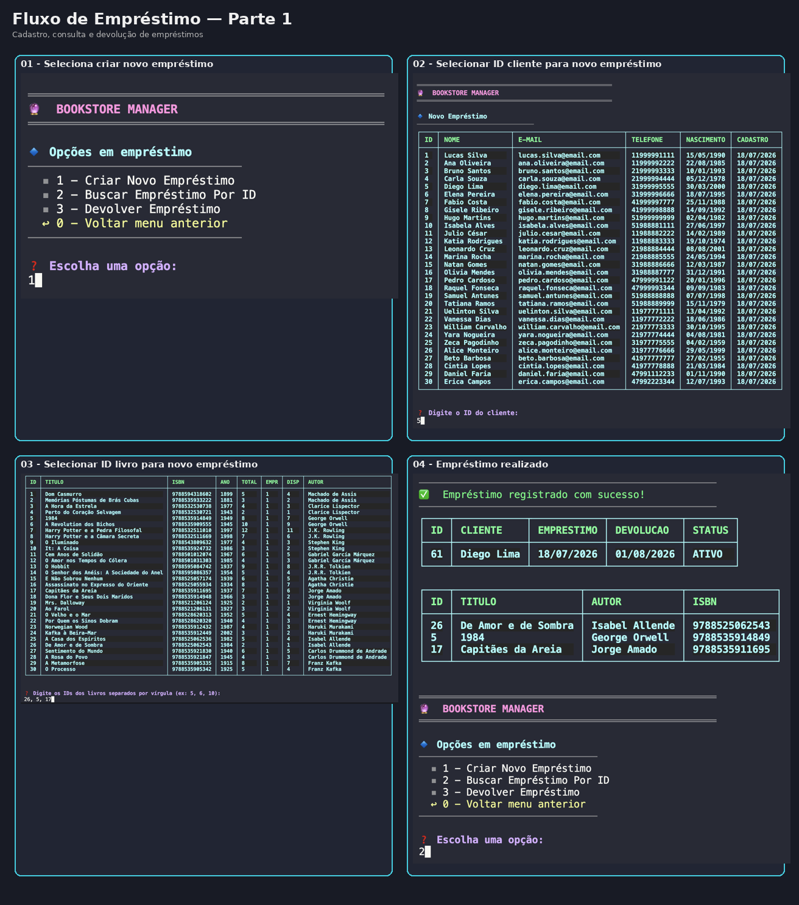

### Busca e devolução

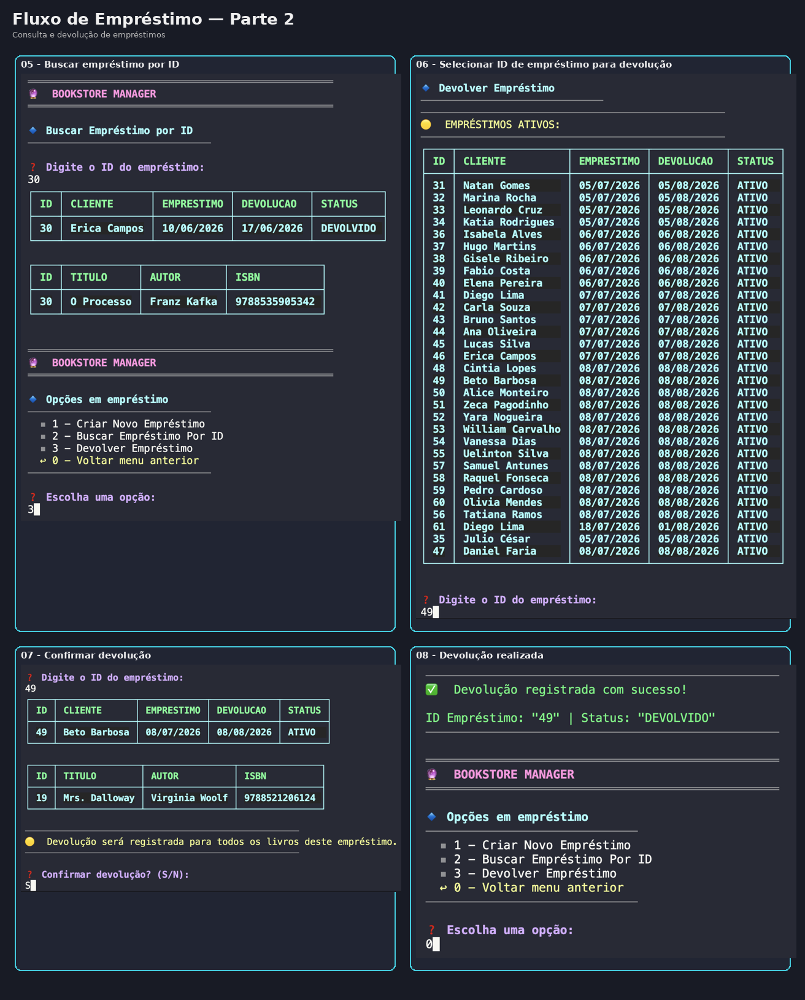


## Funcionalidades — Relatórios

### Exibição de Relatórios

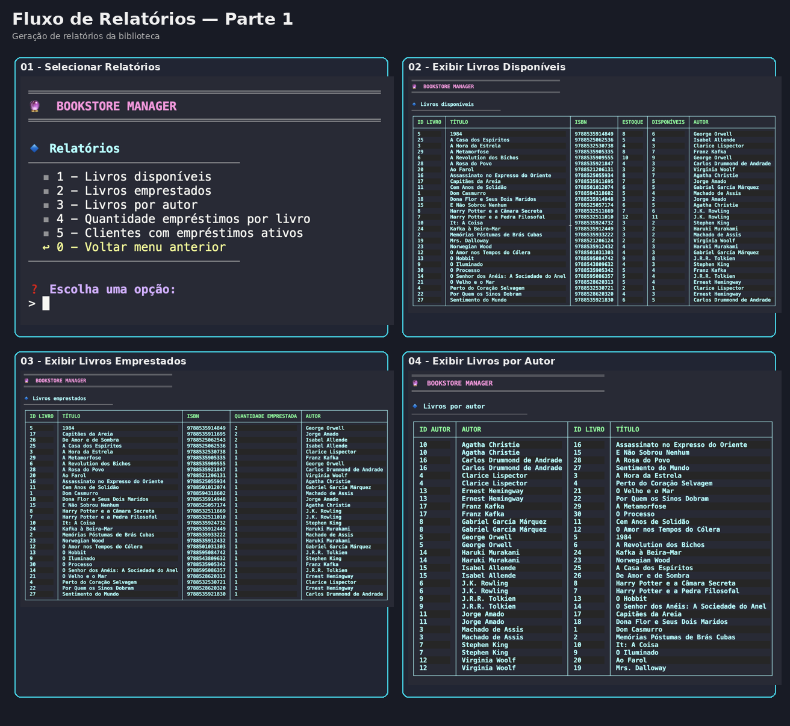

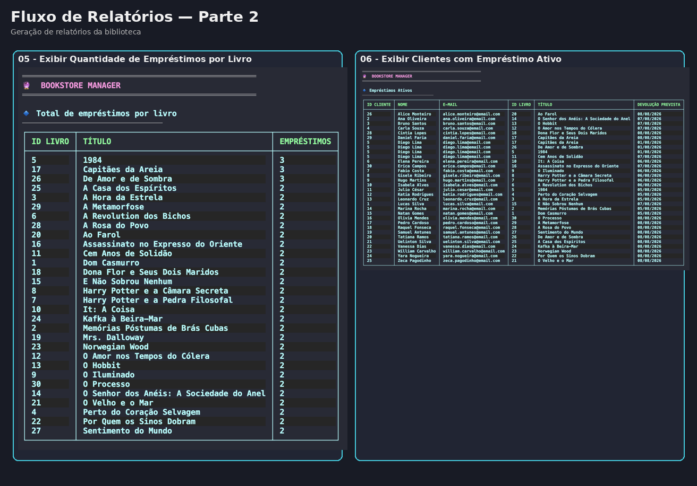

---

# 🚀 Melhorias Futuras

O projeto atende aos requisitos definidos para esta etapa, mas algumas melhorias foram identificadas durante o desenvolvimento e poderão ser implementadas em versões futuras:

- **Aprimorar a tipagem e o tratamento de erros:** substituir o uso do tipo `any` por `unknown`, realizando a verificação segura dos valores antes de acessá-los. Essa melhoria poderá ser aplicada tanto no tratamento de exceções quanto em outros pontos do código que ainda utilizem tipagem genérica.

- **Padronizar os erros da aplicação:** criar classes personalizadas que estendam a classe nativa `Error`, como erros de validação, regras de negócio, registros não encontrados e falhas no banco de dados. Isso permitirá identificar e tratar cada categoria de erro de maneira mais consistente.

- **Implementar a busca de autores por nome:** permitir a localização de autores pelo nome completo ou por parte dele, facilitando a consulta quando o usuário não souber o identificador do registro.

- **Detalhar o relatório de clientes com empréstimos ativos:** incluir o ID de cada empréstimo apresentado no relatório, tornando mais fácil localizar a operação e realizar consultas ou devoluções.

- **Registrar a devolução por livro:** permitir a devolução individual de um livro, em vez de exigir a devolução de todos os livros associados ao mesmo empréstimo.

- **Validar as configurações da aplicação:** verificar, durante a inicialização, se as variáveis de ambiente e as regras presentes no arquivo `configuracoes_empresa.json` possuem valores válidos, exibindo mensagens claras quando houver alguma configuração incorreta.

- **Implementar controle de atrasos:** identificar empréstimos com prazo de devolução vencido e apresentar essa informação nas consultas e nos relatórios.

- **Adicionar renovação de empréstimos:** permitir a alteração da data prevista de devolução, desde que o empréstimo esteja ativo e atenda às regras definidas pela biblioteca.

- **Criar histórico detalhado de movimentações:** registrar empréstimos, devoluções e renovações para facilitar consultas futuras e oferecer maior rastreabilidade das operações.

- **Adicionar paginação e filtros às consultas:** melhorar a visualização quando houver muitos registros, permitindo filtrar livros, clientes, autores e empréstimos por diferentes critérios.

Essas melhorias buscam ampliar a segurança, a manutenibilidade e a experiência de uso da aplicação, além de preparar o projeto para o desenvolvimento de novas funcionalidades.

## Evolução do projeto ao longo do curso

Acompanhando a evolução dos conteúdos abordados nos próximos módulos do curso, o projeto poderá ser ampliado gradualmente, aproveitando a arquitetura em camadas e as regras de negócio já implementadas. Entre as possíveis evoluções, destacam-se:

- **Implementar testes automatizados:** criar testes unitários para as regras de negócio e testes de integração para as operações realizadas no PostgreSQL, reduzindo o risco de regressões durante futuras alterações.

- **Disponibilizar as funcionalidades por meio de uma API REST:** desenvolver uma API com Node.js, TypeScript e Express para permitir que as operações de autores, livros, clientes, empréstimos e relatórios sejam acessadas por requisições HTTP.

---

# 📄 Licença

Projeto desenvolvido exclusivamente para fins acadêmicos.

---
